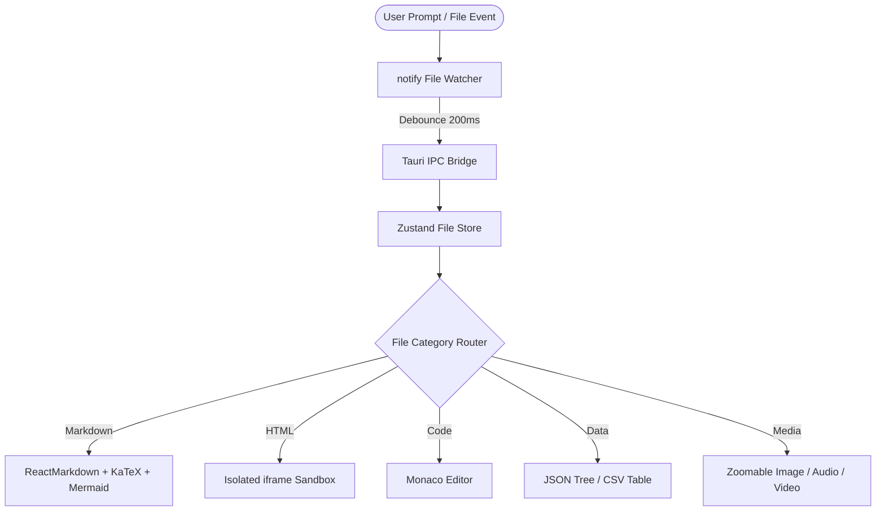
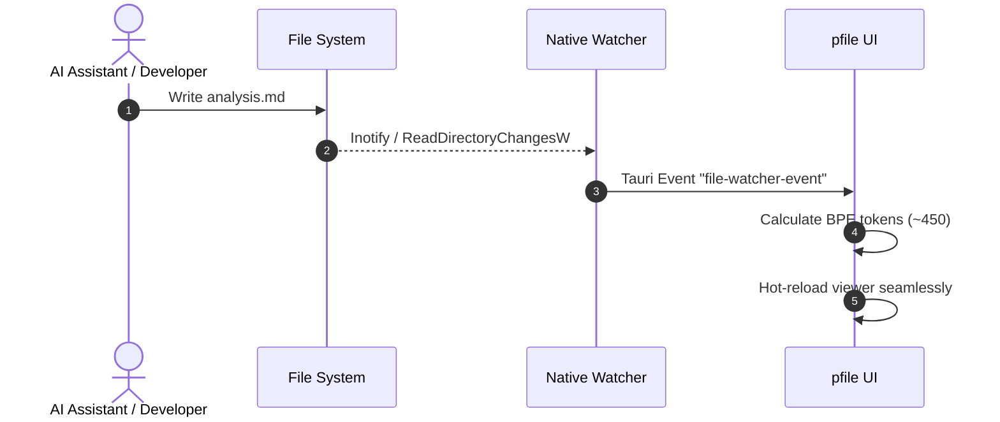

# AI Architecture & Workflow Specification

This document details the multi-agent cognitive architecture for real-time code synthesis and rich previews in **`pfile`**.

## 1. System Flowchart

Here is the pipeline architecture rendered with Mermaid:



## 2. Mathematical Formalization

We formulate token efficiency $\mathcal{E}$ as:

$$
\mathcal{E}(P, M) = \frac{\sum_{i=1}^N \mathcal{T}(c_i)}{\mathcal{L}_{\text{BPE}}(P)} \times \exp(-\lambda \cdot \Delta t)
$$

Where:
- $\mathcal{T}(c_i)$ represents contextual relevance of segment $i$.
- $\mathcal{L}_{\text{BPE}}(P)$ is the byte-pair token length using `cl100k_base`.
- $\Delta t$ is the latency overhead.

## 3. Benchmark Comparison Matrix

| Model Identifier | Context Window | cl100k Efficiency | Latency (ms) | Supported Formats |
| :--- | :--- | :--- | :--- | :--- |
| **GPT-4o** | 128k | 98.4% | 320ms | MD, Code, SVG, JSON |
| **Claude 3.5 Sonnet** | 200k | 99.1% | 290ms | Full Stack Prototypes |
| **DeepSeek V3** | 64k | 96.8% | 240ms | Algorithmic Code |

## 4. Sequence Interaction



```typescript
// Sample context formatter
export function computeEfficiency(tokens: number, size: number): number {
  return tokens / (size || 1);
}
```
